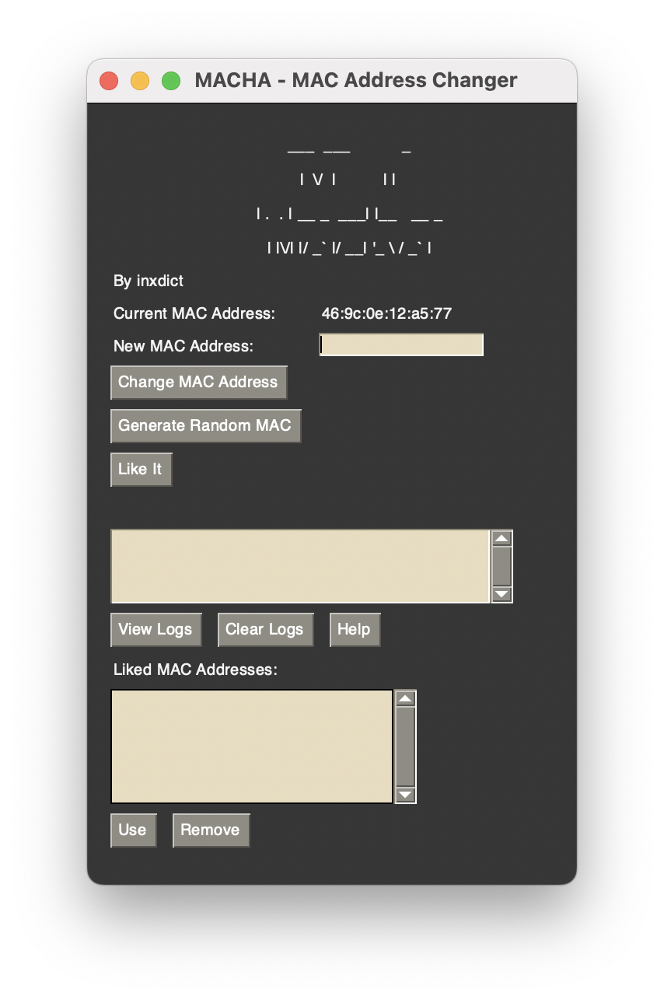
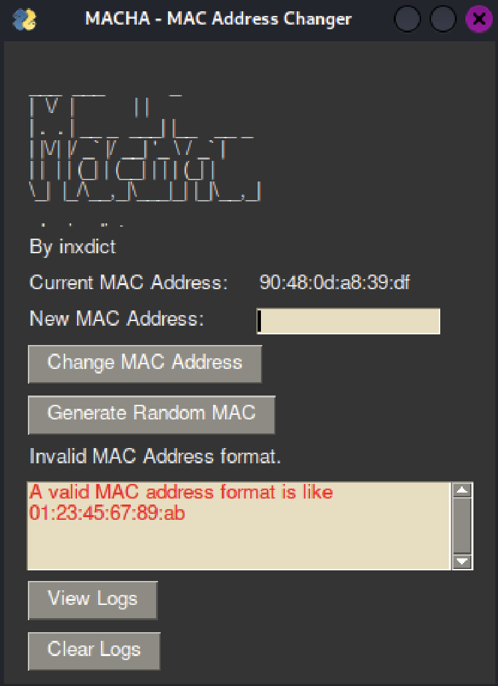
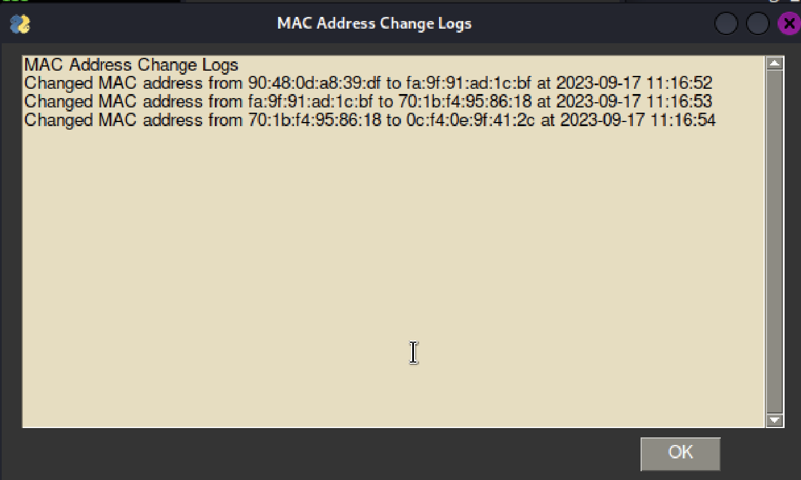

# MACHA - MAC Address Changer


## Introduction

MACHA (MAC Address Changer) is a Python-based cross-platform application for changing your MAC (Media Access Control) address on Linux, Windows, and macOS. It provides an easy-to-use graphical interface for modifying your MAC address quickly.

### Features

- Change your MAC address with a single click.
- Generate random MAC addresses for enhanced privacy.
- View and clear change logs to track your MAC address history.
- Automatically change the application's theme for an enhanced visual experience.
- Works on Linux, Windows, and macOS.

### Prerequisites

Before running MACHA, ensure that you have Python installed on your system.

### PySimpleGUI

MACHA uses the PySimpleGUI library for its graphical user interface. You can install it using pip:

```shell
pip install PySimpleGUI
```

## Installation

Follow the instructions below to install and run MACHA on your respective platform.

### Linux

1. Ensure you have Python 3.x installed on your system. If not, you can download it from the [official Python website](https://www.python.org/downloads/).

2. Clone this repository to your local machine or download the ZIP file and extract it.

3. Open the terminal and navigate to the project's directory using the `cd` command:

   ```shell
   cd /path/to/macha
   ```

5. Install the required Python packages using `pip`:

   ```shell
   pip install -r requirements.txt
   ```

7. Run the application with superuser privileges using `sudo`:

   ```shell
   sudo python macha.py
   ```

### Windows

1. Ensure you have Python 3.x installed on your system. If not, you can download it from the [official Python website](https://www.python.org/downloads/windows/).

2. Clone this repository to your local machine or download the ZIP file and extract it.

3. Open the Command Prompt and navigate to the project's directory using the `cd` command:

   ```shell
   cd C:\path\to\macha
   ```

5. Install the required Python packages using `pip`:

   ```shell
   pip install -r requirements.txt
   ```

6. Run the application with administrator privileges by right-clicking `macha.py` and selecting "Run as administrator."

### macOS

1. Ensure you have Python 3.x installed on your system. If not, you can download it from the [official Python website](https://www.python.org/downloads/mac-osx/).

2. Clone this repository to your local machine or download the ZIP file and extract it.

3. Open the Terminal and navigate to the project's directory using the `cd` command:

   ```shell
   cd /path/to/macha
   ```

5. Install the required Python packages using `pip`:

   ```shell
   pip install -r requirements.txt
   ```

7. Run the application with superuser privileges using `sudo`:

   ```shell
   sudo python macha.py
   ```

## Usage

Upon launching the application, you'll be presented with a user-friendly interface:



Follow these steps to use the application:

1. **Current MAC Address**: This section displays your current MAC address.

2. **New MAC Address**: Enter the desired new MAC address in the provided input field.

3. **Change MAC Address**: Click this button to change your MAC address to the one specified.

4. **Generate Random MAC**: Click this button to generate a random MAC address for increased privacy.

5. **Status**: This area displays the status of your MAC address change operation.

6. **Error Log**: If any errors occur, they will be displayed here in red.

7. **View Logs**: Click this button to view the MAC address change logs.

8. **Clear Logs**: Click this button to clear the logs.

## Screenshots





## License

This project is licensed under the MIT License. See the [LICENSE](LICENSE) file for details.

---

Feel free to contribute to this project by reporting issues or submitting pull requests.
